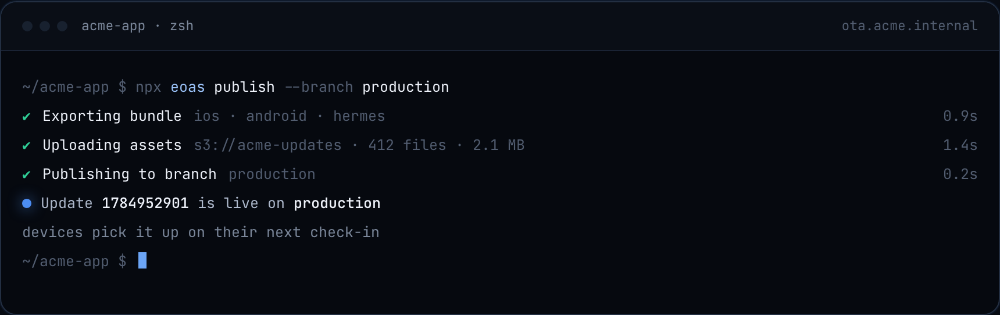
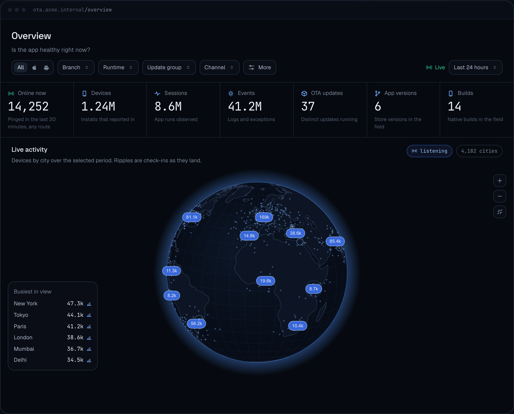
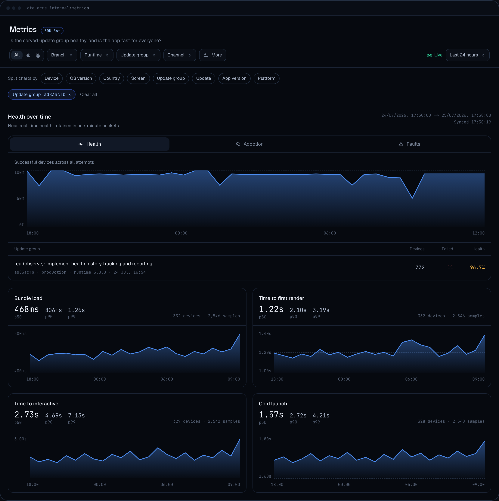

<p align="center">
  
</p>

<h3 align="center">xprem: Self-hosted OTA updates and control plane for Expo apps</h3>

<p align="center">
  <sub>Formerly known as <b>Expo Open OTA</b> (expo-open-ota): same project, same maintainers, renamed to respect Expo's trademark.
</p>

<p align="center">
  xprem serves over-the-air (OTA) updates to Expo and React Native apps running <a href="https://docs.expo.dev/versions/latest/sdk/updates/">expo-updates</a>,<br/>
  through the official <a href="https://docs.expo.dev/technical-specs/expo-updates-1/">Expo Updates protocol</a>, as an open-source alternative to EAS Update.<br/>
  Around the updates it runs a full control plane: branches, channels, progressive rollouts,<br/>
  and per-update health, metrics, events and logs coming back from every device through expo-observe.
</p>

<p align="center">
  <a href="https://github.com/mercuretechnologies/xprem/releases"></a>
  <a href="https://www.npmjs.com/package/eoas"></a>
  <a href="https://github.com/mercuretechnologies/xprem/actions"></a>
  <a href="./LICENSE.md"></a>
  <a href="https://matrix.to/#/#xprem.dev:matrix.org"></a>
</p>

<p align="center">
  <a href="https://mercure-technologies.gitbook.io/xprem">Documentation</a> · <a href="#quick-start">Quick start</a> · <a href="https://xprem.dev">Website</a> · <a href="https://github.com/mercuretechnologies/xprem/issues">Issues</a> · <a href="https://matrix.to/#/#xprem.dev:matrix.org">Matrix</a> · <a href="mailto:contact@xprem.dev">Contact</a>
</p>

<p align="center">
  <a href="https://cursor.com/en/install-mcp?name=xprem-docs&config=eyJ1cmwiOiJodHRwczovL21lcmN1cmUtdGVjaG5vbG9naWVzLmdpdGJvb2suaW8veHByZW0vfmdpdGJvb2svbWNwIn0%3D"></a>
  <a href="https://insiders.vscode.dev/redirect/mcp/install?name=xprem-docs&config=%7B%22type%22%3A%22http%22%2C%22url%22%3A%22https%3A%2F%2Fmercure-technologies.gitbook.io%2Fxprem%2F~gitbook%2Fmcp%22%7D"></a>
</p>
<p align="center">
  <sub>The documentation is exposed as an <a href="#ask-the-docs-from-your-ai-assistant">MCP server</a>: plug it into Cursor, VS Code, Claude Code or any MCP client.</sub>
</p>


<p align="center">
  
</p>

> xprem has served OTA updates in production since early 2025, to apps totaling more than a million monthly active users.

## Features

- **Publish, roll back, republish** OTA updates from the [eoas](https://www.npmjs.com/package/eoas) CLI, in CI or from the dashboard
- **Channels**: each build ships with a channel baked in; point the channel at a branch to decide what those builds receive, and remap it to roll out or roll back without a rebuild or store review
- **Progressive rollouts**: serve an update to a percentage of a branch and raise it as health data comes in; the split is deterministic and needs no per-device state
- **A/B testing**: one channel can serve two branches at once, with devices split deterministically between them
- **Multi-app**: one server hosts all your Expo apps, each with its own branches, channels, API tokens and update history; no Expo account required
- **Observability**: native and JS crashes, adoption, bundle load and render times, plus your own events and logs, all tied to the exact update that produced them, stored in your ClickHouse
- **Storage backends**: AWS S3, Google Cloud Storage, Azure Blob Storage, Cloudflare R2, MinIO, DigitalOcean Spaces, Supabase Storage, any S3-compatible service, or the local file system
- **Delivery**: CloudFront, custom CDN domain, S3 presigned URLs, GCS signed URLs, Azure SAS URLs, or direct serving
- **Code signing**: standard expo-updates code signing, with keys in AWS Secrets Manager, environment variables, local files or sealed in the database
- **MCP server**: agents operate branches, channels and rollouts and query telemetry over OAuth, with per-user permissions
- **Deployment**: Docker image, Helm chart, or a single static Go binary; a stateless mode runs without any database
- **Open source**: the update pipeline is MIT; RBAC, SSO, branch protection and custom device attributes are commercial and live in [`ee/`](./ee)

## OTA updates, channels and rollouts

xprem implements the official Expo Updates protocol, so your app keeps the standard `expo-updates` runtime with no fork and no custom client. Every bundle lives in your own bucket and every download URL points at infrastructure you own.

Publish, roll back and republish are [eoas](https://www.npmjs.com/package/eoas) commands. Run them by hand or script them in your pipeline.

<p align="center">
  
</p>

Each build ships with a release channel baked in. Point the channel at a branch, and that is what those builds receive. Remap it to roll out, remap it back to roll back, with no rebuild and no store review.

A rollout serves an update to a slice of the branch. You watch the health chart and raise the percentage, or revert. A channel can also serve two branches at once with a deterministic device split, which gives you A/B testing in production without any extra tooling.

## Observability

Every crash, metric, event and log carries the exact update that produced it, so a regression shows up while the rollout is still on a slice of the branch, and a republish reverts it.

<p align="center">
  
</p>

**Native and JS crashes.** Both land tied to the update that shipped them, with the device count for each.

**Breakdowns.** Every metric splits by device model, OS, region, app version and screen, straight from react-navigation.

**Your own events and logs.** Ship structured events and logs from the app, and read them next to the delivery data, filtered by the same update, branch and channel.

**Your ClickHouse, your tools.** The data lives in a database you own. Point Grafana, PostHog or Datadog at it, or query it directly. Hermes source maps are supported for Sentry or PostHog.

<p align="center">
  
</p>

## Storage and delivery

When a device checks for an update, xprem answers with a manifest: the list of assets to download, each with a URL. xprem decides what those URLs are. Point them at your CDN, or sign them into a private bucket that never has to be made public.

Download traffic never touches the update server, which only answers a small JSON check. Millions of devices checking in never turn into millions of downloads hitting it.

| | |
|---|---|
| **Storage** |  AWS S3 &nbsp;·&nbsp;  Google Cloud Storage &nbsp;·&nbsp;  Azure Blob Storage &nbsp;·&nbsp;  Cloudflare R2 &nbsp;·&nbsp;  MinIO &nbsp;·&nbsp;  DigitalOcean Spaces &nbsp;·&nbsp;  Supabase Storage &nbsp;·&nbsp; any S3-compatible storage &nbsp;·&nbsp; local file system |
| **Delivery** |  CloudFront &nbsp;·&nbsp; custom CDN domain &nbsp;·&nbsp;  S3 presigned URLs &nbsp;·&nbsp;  GCS signed URLs &nbsp;·&nbsp;  Azure SAS URLs &nbsp;·&nbsp; direct serving |
| **Cache** |  Redis &nbsp;·&nbsp; in-memory |
| **Key store** |  AWS Secrets Manager &nbsp;·&nbsp; environment variables &nbsp;·&nbsp; local key files &nbsp;·&nbsp; sealed in the database |

## MCP server

xprem ships an MCP server, so agents reach the same control plane you do: branches, channels, updates, rollouts and the whole observability dataset. Agents sign in with OAuth as dashboard users, and every call runs with that user's per-app permissions, nothing more. No API keys.

> "Which screens had the worst time to interactive since 3.4.2 rolled out?"
>
> "Create a hotfix branch and point the beta channel at it."
>
> "Something looks wrong since the last release. Roll production back to the previous update."


The tools cover the same operations as the dashboard: list branches, channels and updates, check a rollout, roll back, republish, and ask plain-language questions over metrics, events and logs.

## Deployment

xprem is one Go process. It holds no session state, so you run as many replicas as you need behind your load balancer and they stay consistent on their own. Update checks are read-heavy and cheap; assets never pass through the process, so a replica only ever handles small JSON.

Run it with Docker, the Helm chart, or a single static binary under systemd. You choose the shape at deploy time: if the only thing you want is to ship updates from your own bucket, stateless mode needs no database at all; plug in PostgreSQL when you want the multi-app dashboard, rollouts and the control plane. Prometheus metrics are built in.

## Benchmark

One instance, 1 vCPU, serving real expo-updates polls from a pool of 100,000 devices. Every response RSA-signed, device telemetry writing every device to the registry, nothing switched off. The load is applied in an open model, so the target rate is imposed whether or not the server keeps up and queueing shows up as latency instead of being hidden by a slower client.

| | |
|---|---|
| **Server** | EC2 `c6g.medium` · 1 vCPU (Graviton2) · 2 GiB RAM |
| **Database** | RDS PostgreSQL `db.t4g.small` · 2 vCPU · 2 GiB RAM |
| **Storage** | Google Cloud Storage |
| **Enabled** | Code signing · device telemetry |

| Phase | Rate | Mean | p95 | p99 | Errors |
|---|---|---|---|---|---|
| Real fleet traffic | 230 req/s | 1.46 ms | 1.58 ms | 2.35 ms | 0 |
| Capacity probe | 650 req/s | 1.02 ms | 1.39 ms | 2.28 ms | 0 |
| Full-fleet rollout | 938 req/s | 3.15 ms | 20.5 ms | 55.2 ms | 0 |

294,372 requests, no error and no request the generator failed to inject. Every statistic above is measured over the same window: the phase minus the first 60 seconds of the run, which are the cold start. The probe was built to find the point where latency leaves its baseline and did not find one, so 650 req/s is a floor on what this configuration serves rather than a ceiling. The server peaked at 87.8% of its single core during the rollout phase; the database peaked at 27% and read almost nothing from disk, since its working set fits in memory.

Applied to a fleet, one update check per app launch: a typical app produces around 20 req/s per million monthly active users, one that gets opened all day around 115.

[**test/load/results**](test/load/results/) has the full method, the per-phase summary, the raw time series and what this run does not establish, next to the k6 script that produced it.

## Quick start

[](https://railway.com/deploy/expo-open-ota?referralCode=OEHlEK&utm_medium=integration&utm_source=template&utm_campaign=generic)

1. Deploy the server with the Railway button above, Docker or the Helm chart.
2. Run `npx eoas init` in your Expo project to wire it to your server.
3. Publish your first update with `npx eoas publish --branch production`.

The full walkthrough for both modes is in the documentation: [stateless mode](https://mercure-technologies.gitbook.io/xprem/stateless-mode/getting-started) and [control plane mode](https://mercure-technologies.gitbook.io/xprem/controle-plane-mode/getting-started). Coming from v2? Follow the [migration guide](https://mercure-technologies.gitbook.io/xprem/changelog-and-migrations/migrate-from-v2-to-v3).

### Ask the docs from your AI assistant

The documentation is exposed as an MCP server, so your AI tools can answer questions about xprem with the docs as their source:

```
https://mercure-technologies.gitbook.io/xprem/~gitbook/mcp
```

Use the install buttons at the top of this page for Cursor and VS Code. For Claude Code:

```bash
claude mcp add --transport http xprem-docs https://mercure-technologies.gitbook.io/xprem/~gitbook/mcp
```

Any other MCP-compatible client (ChatGPT connectors included) can be pointed at the same URL.

## Why self-host

EAS Update is the fastest way to get OTA updates running on a small app. These are the reasons teams move to self-hosted infrastructure instead.

**No per-user pricing.** Nothing is metered. Unlimited devices and unlimited updates, for the cost of the server, the database and the bucket you already run.

**You own the data.** Update history in your Postgres, runtime signals in your ClickHouse, bundles in your bucket. Retention, residency, access rules and audit trail are yours to configure.

**Runs on a private or offline network.** Air-gapped deployments, internal apps and regulated environments. No outbound connection, no telemetry, and Enterprise licence keys verify offline.

**You control the scaling.** Stateless replicas behind your own load balancer, your CDN and the regions you choose. Capacity and rate limits are set by your infrastructure.

**No intermediary in the path.** Device to your server to your edge, over private links and internal DNS, inside the regions you already operate in.

**No vendor dependency.** The core is MIT, readable and forkable. Your release path does not depend on a vendor staying alive.

## License model

Publishing, branches, channels, rollbacks, progressive rollouts, every storage backend, every CDN integration, the dashboard and the Prometheus metrics are MIT. Everything you need to run OTA updates in production, free. A feature released under MIT never moves behind the commercial licence.

### Four things need a licence

They live in [`ee/`](./ee) directories in the same repository and ship in the same binary, so you can read the code before you buy. The key is verified offline: the server never contacts us, sends no telemetry, and keeps working in an air-gapped network.

- **RBAC**: roles instead of one shared admin account. Decide who can publish, who can move a channel to another branch, and who can only look.
- **SSO**: sign in through Microsoft Entra ID, Okta, Google Workspace, Keycloak or any OpenID Connect issuer, so access follows the accounts you already manage and revoke.
- **Branch protection**: mark the branches that reach real users as protected, then decide per API key whether it may publish to them. A sandbox CI job or a developer testing on staging gets a token that cannot touch production, instead of the one token that can do everything.
- **Custom device attributes**: attach your own attributes to logs, metrics and events, then slice by them. Your plan tier, your tenant, your feature flag, whatever your app knows about the device.


For a license, [contact us](mailto:contact@xprem.dev).

## Contributing

Contributions are welcome! For anything beyond a small fix, please open an issue before writing code. xprem is an open-core project and some advanced features are reserved for the commercial edition; the boundary is documented in [CONTRIBUTING.md](./CONTRIBUTING.md).

## Disclaimer

xprem is **not officially supported or affiliated with [Expo](https://expo.dev/)**. This is an independent open-source project.

## License

The core is MIT and will stay MIT. Enterprise features live in `ee/` directories and are covered by a commercial license (see [ee/LICENSE](./ee/LICENSE)); everything else is MIT (see [LICENSE](./LICENSE.md)).

## Contact

[contact@xprem.dev](mailto:contact@xprem.dev)
