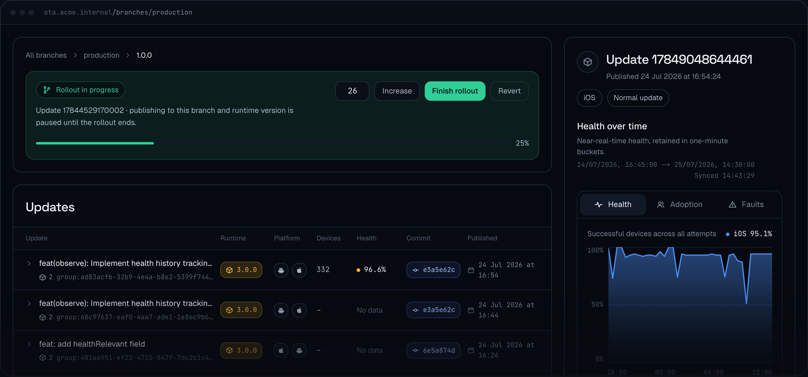

<p align="center">
  
</p>

<h3 align="center">xprem: Self-hosted OTA updates for Expo & React Native apps</h3>

<p align="center">
  <sub>Formerly known as <b>Expo Open OTA</b> (expo-open-ota)
</p>

<p>
  xprem sends over-the-air (OTA) updates to Expo and React Native apps. It speaks the official <a href="https://docs.expo.dev/technical-specs/expo-updates-1/">Expo Updates protocol</a>, so any app running <a href="https://docs.expo.dev/versions/latest/sdk/updates/">expo-updates</a> can talk to it. It is an open-source alternative to EAS Update, on your own servers.<br/><br/>
  The server also handles branch and channel mapping, progressive rollouts and rollbacks. It is compatible with expo-observe, which reports logs, metrics and events back from your apps.
  <br/>
  <br/>
</p>

<p align="center">
  <a href="https://github.com/mercuretechnologies/xprem/releases"></a>
  <a href="https://www.npmjs.com/package/eoas"></a>
  <a href="https://github.com/mercuretechnologies/xprem/actions"></a>
  <a href="./LICENSE.md"></a>
</p>

<p align="center">
  <a href="https://mercure-technologies.gitbook.io/xprem">Documentation</a> · <a href="#quick-start">Quick start</a> · <a href="https://xprem.dev">Website</a> · <a href="https://discord.gg/TSJgqPyGr4">Discord</a> · <a href="https://github.com/mercuretechnologies/xprem/issues">Issues</a> · <a href="mailto:contact@xprem.dev">Contact</a>
</p>

<p align="center">
  <a href="https://cursor.com/en/install-mcp?name=xprem-docs&config=eyJ1cmwiOiJodHRwczovL21lcmN1cmUtdGVjaG5vbG9naWVzLmdpdGJvb2suaW8veHByZW0vfmdpdGJvb2svbWNwIn0%3D"></a>
  <a href="https://insiders.vscode.dev/redirect/mcp/install?name=xprem-docs&config=%7B%22type%22%3A%22http%22%2C%22url%22%3A%22https%3A%2F%2Fmercure-technologies.gitbook.io%2Fxprem%2F~gitbook%2Fmcp%22%7D"></a>
</p>

<p align="center">
  
</p>

> xprem has served OTA updates in production since early 2025, to apps totaling more than a million monthly active users.

## Features

- **Publish, roll back, republish** OTA updates from the [eoas](https://www.npmjs.com/package/eoas) CLI, in CI or from the dashboard
- **Channels & Branches mapping**: Build your apps with different release channels (e.g. production/staging) and point them to specific branches.
- **Progressive rollouts**: Serve an update to a percentage of your users' fleet and update it progressively / roll it back.
- **A/B testing**: one channel can serve two branches at once, with devices split deterministically between them
- **Multi-app**: one server can host multiple applications
- **Observability**: the xprem server can collect events & metrics from expo-observe and store everything in your own ClickHouse instance.
- **End-to-end code signing**: the server signs every manifest with a private key you own; the matching certificate ships inside the app, and expo-updates refuses any update that does not verify against it: a compromised bucket or CDN cannot push code into your app.
- **MCP server**: Your xprem server comes with an MCP server that allows agents to operate branches, channels and rollouts and query telemetry over OAuth, with per-user permissions
- **Deployment**: Docker image, Helm chart, or a single static Go binary; a stateless mode runs without any database

## Storage and delivery

Your updates stay in your own infrastructure. xprem uploads every bundle and its assets to your bucket, and devices download them from your CDN.

Most providers are already supported. If yours is missing, feel free to open an issue.

| | |
|---|---|
| **Storage** |  AWS S3 &nbsp;·&nbsp;  Google Cloud Storage &nbsp;·&nbsp;  Azure Blob Storage &nbsp;·&nbsp;  Cloudflare R2 &nbsp;·&nbsp;  MinIO &nbsp;·&nbsp;  DigitalOcean Spaces &nbsp;·&nbsp;  Supabase Storage &nbsp;·&nbsp; any S3-compatible storage &nbsp;·&nbsp; local file system |
| **Delivery** |  CloudFront &nbsp;·&nbsp; custom CDN domain &nbsp;·&nbsp;  S3 presigned URLs &nbsp;·&nbsp;  GCS signed URLs &nbsp;·&nbsp;  Azure SAS URLs &nbsp;·&nbsp; direct serving |
| **Cache** |  Redis &nbsp;·&nbsp; in-memory |
| **Key store** |  AWS Secrets Manager &nbsp;·&nbsp; environment variables &nbsp;·&nbsp; local key files &nbsp;·&nbsp; sealed in the database |

## Deployment

xprem is one Go process, deployed as a single instance or as many replicas as you need. The project ships a Docker image and a Helm chart to keep the deployment simple, plus `npx eoas server:init`, a utility that sets up the environment for your configuration.

## Benchmark

We want to ship an update server that is fast and cheap to run. We benchmarked it against the traffic of a fleet of one million monthly active users, on a single vCPU and a small database, with telemetry enabled:

| | |
|---|---|
| **Server** | EC2 `c6g.medium` · 1 vCPU (Graviton2) · 2 GiB RAM |
| **Database** | RDS PostgreSQL `db.t4g.small` · 2 vCPU · 2 GiB RAM |
| **Storage** | Google Cloud Storage |
| **Enabled** | Code signing · device telemetry |

| Phase | Rate | Mean | p95 | p99 | Errors |
|---|---|---|---|---|---|
| Real fleet traffic | 230 req/s | 1.46 ms | 1.58 ms | 2.35 ms | 0 |
| Capacity probe | 650 req/s | 1.02 ms | 1.39 ms | 2.28 ms | 0 |
| Full-fleet rollout | 938 req/s | 3.15 ms | 20.5 ms | 55.2 ms | 0 |

The method and the raw numbers are committed in [test/load/results](test/load/results/). Feel free to challenge them.


### Ask the docs from your AI assistant

The documentation is exposed as an MCP server, so your AI tools can answer questions about xprem with the docs as their source:

```
https://mercure-technologies.gitbook.io/xprem/~gitbook/mcp
```

Use the install buttons at the top of this page for Cursor and VS Code. For Claude Code:

```bash
claude mcp add --transport http xprem-docs https://mercure-technologies.gitbook.io/xprem/~gitbook/mcp
```

Any other MCP-compatible client (ChatGPT connectors included) can be pointed at the same URL.

## Why choose xprem

xprem was originally built to run in production for apps with hundreds of thousands of monthly active users, under strong security and performance constraints.
The server is production-ready and enterprise-ready, and it is actively maintained. Feel free to contact us at [contact@xprem.dev](mailto:contact@xprem.dev) if you want to know more.

- **No per-user pricing.**

- **You own the data.**

- **Runs on a private or offline network.**

- **You control the scaling.**

- **No intermediary in the path.**

- **No vendor dependency.**


## Contributing

Contributions are welcome! For anything beyond a small fix, please open an issue before writing code. xprem is an open-core project and some advanced features are reserved for the commercial edition; the boundary is documented in [CONTRIBUTING.md](./CONTRIBUTING.md).

## Disclaimer

xprem is **not officially supported or affiliated with [Expo](https://expo.dev/)**. This is an independent open-source project.

## License

The core is MIT and will stay MIT. Enterprise features live in `ee/` directories and are covered by a commercial license (see [ee/LICENSE](./ee/LICENSE)); everything else is MIT (see [LICENSE](./LICENSE.md)).

## Contact

[contact@xprem.dev](mailto:contact@xprem.dev)
